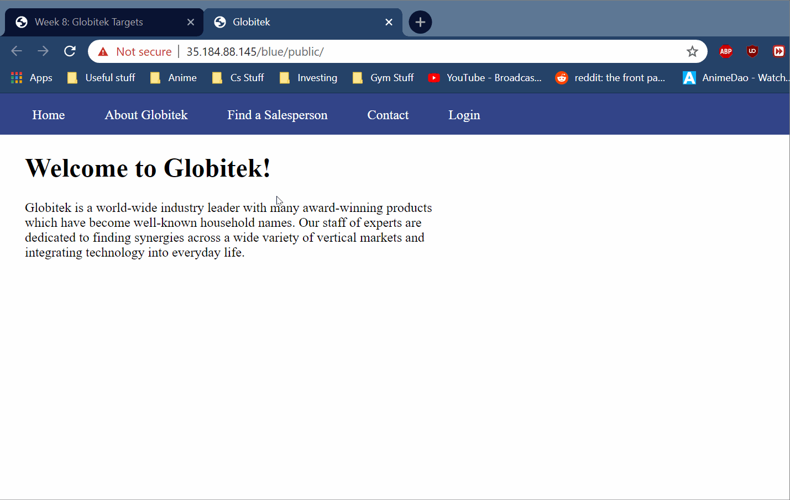
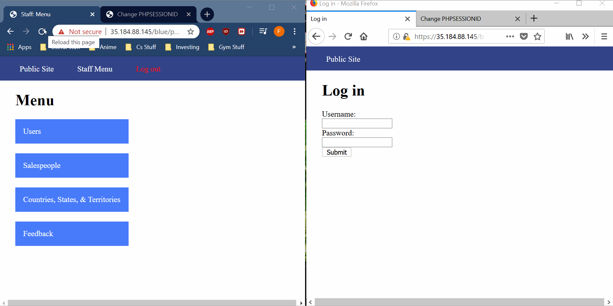
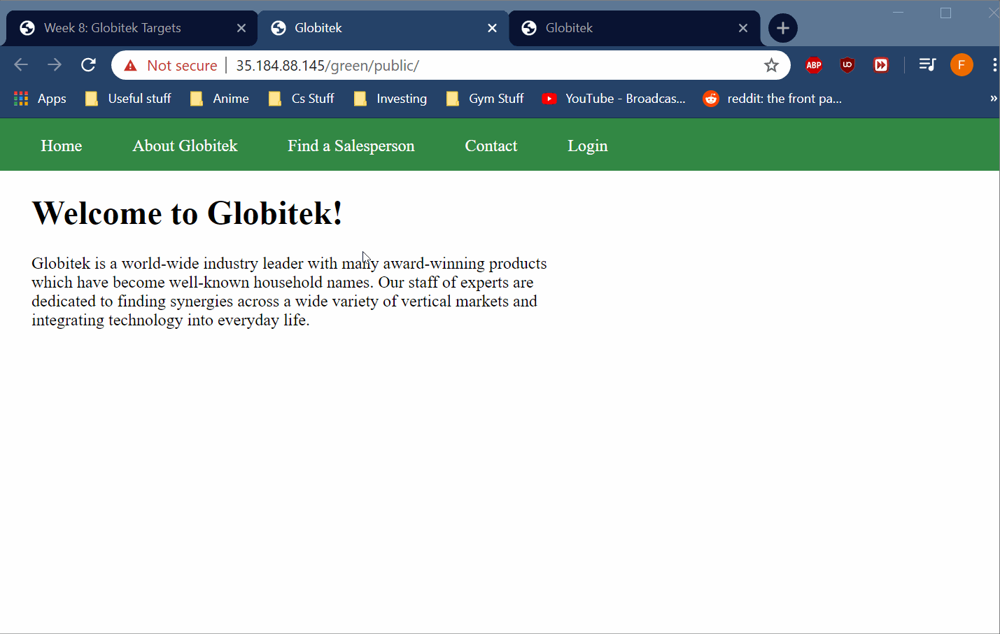
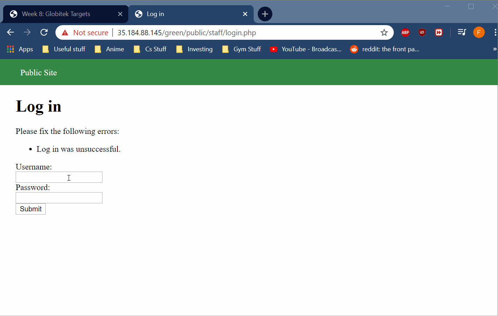
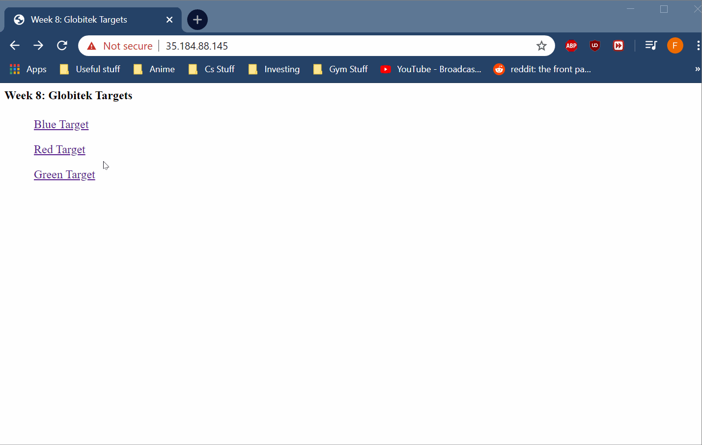
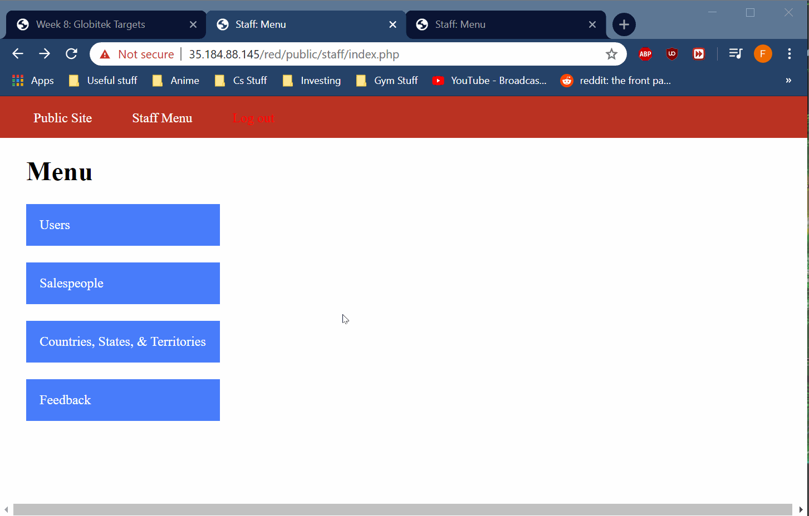

# Web-Security-Week-9
This is the Week 9 assignment write up for the Web Security course by CodePath.

# Project 8 - Pentesting Live Targets

Time spent: **3** hours spent in total

> Objective: Identify vulnerabilities in three different versions of the Globitek website: blue, green, and red.

The six possible exploits are:
* Username Enumeration
* Insecure Direct Object Reference (IDOR)
* SQL Injection (SQLi)
* Cross-Site Scripting (XSS)
* Cross-Site Request Forgery (CSRF)
* Session Hijacking/Fixation

Each version of the site has been given two of the six vulnerabilities. (In other words, all six of the exploits should be assignable to one of the sites.)

## Blue

Vulnerability #1: SQL Injection(SQLi)
- [ ] GIF Walkthrough: 
- [ ] Steps to recreate:
	1) Go to the URL https://35.184.88.145/blue/public/salesperson.php?id=1
	2) Change the ID parameter value to **'OR 1=1' --**

Vulnerability #2: Session Hijacking/Fixation
- [ ] GIF Walkthrough: 
- [ ] Steps to recreate:
	1) Go to the URL https://35.184.88.145/blue/public/staff/login.php
	2) Use the credentials **pperson** and password **StaR!49*whiz** to login
	3) Use the URL https://35.184.88.145/blue/public/hacktools/change_session_id.php to get the session ID
	4) Open a different browser and go to https://35.184.88.145/blue/public/hacktools/change_session_id.php
	   and change this browser's session ID to the one from step 3
	5) Go to the URL https://35.184.88.145/blue/public/staff/login.php in the browser from step number 4 and
	   verify that you are logged in

## Green

Vulnerability #1: Cross-Site Scripting(XSS)
- [ ] GIF Walkthrough: 
- [ ] Steps to recreate:
	1) Go to the URL https://35.184.88.145/green/public/contact.php
	2) Enter any javascript into the feedback section
	   I used:
	   ****
	3) Click submit
	4) Use the credentials **pperson** and password **StaR!49*whiz** to login
	5) Click feedback and there will be a popup with the alert from the script

Vulnerability #2: Username Enumeration
- [ ] GIF Walkthrough: 
- [ ] Steps to recreate:
	1) Go to the URL https://35.184.88.145/green/public/contact.php
	2) Enter an existing username and wrong password
	   I used:
	   **pperson** and password is **123**
	3) Enter a non-existing username and wrong password
	   I used:
	   **pperson12** and password is **123**

## Red

Vulnerability #1: Insecure Direct Object Reference(IDOR)
- [ ] GIF Walkthrough: 
- [ ] Steps to recreate:
	1) Go to the URL https://35.184.88.145/red/public/territories.php
	2) Click on any salesperson
	3) Change the ID parameter value to 10

Vulnerability #2: Cross-Site Request Forgery(CSRF)
- [ ] GIF Walkthrough: 
- [ ] Steps to recreate:
	1) Go to the URL https://35.184.88.145/green/public/contact.php
	2) Use the credentials **pperson** and password **StaR!49*whiz** to login
	3) Click on Users and edit any entry I used the first one
	4) Right click your mouse and click inspect element
	5) Find form and change the csrf_token value to anything
	6) Edit the values to anything you want
	7) Click update and the changes will go through
	8) If you try this on other browsers you will get an error.

## Notes

Describe any challenges encountered while doing the work:
No challenges in particular, just figuring out how to reload the blue website when changing session ID was a bit annoying.
Instead of refreshing, I had to click public, then login for it to work.
